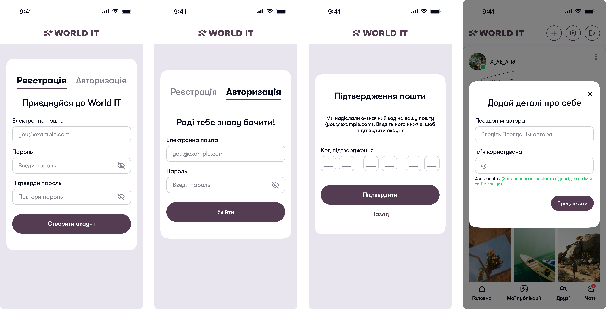
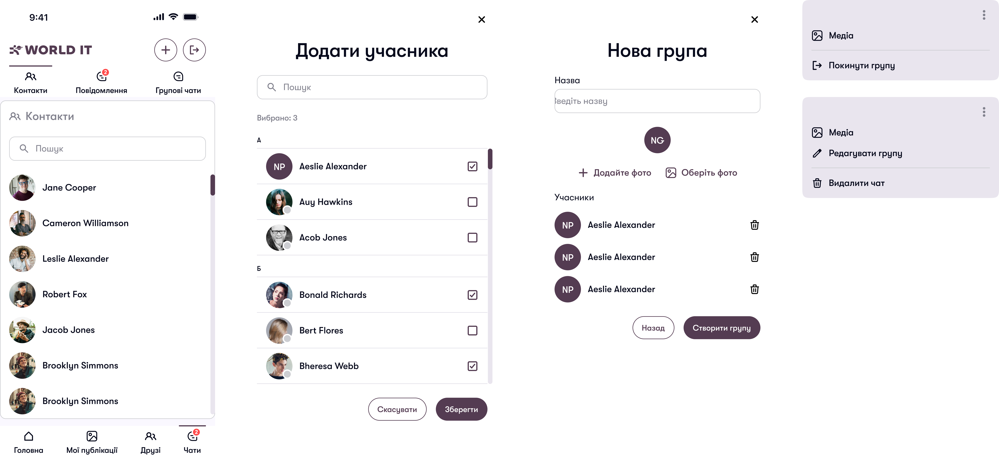
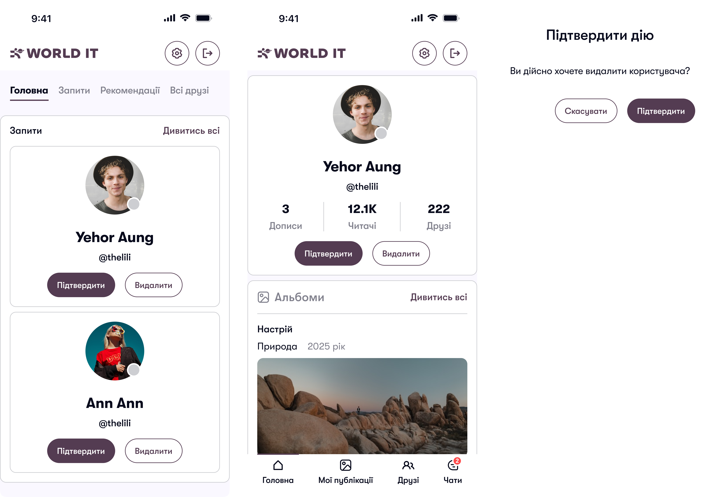
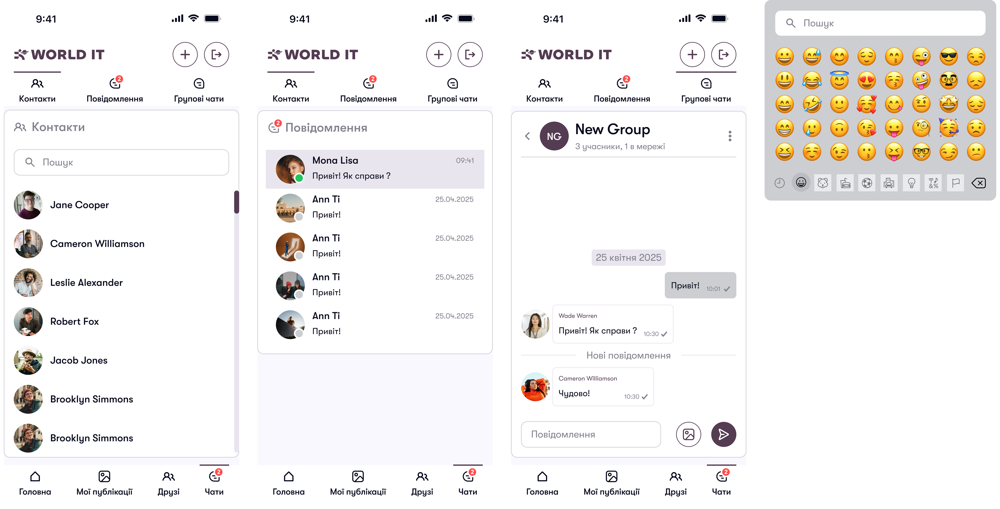
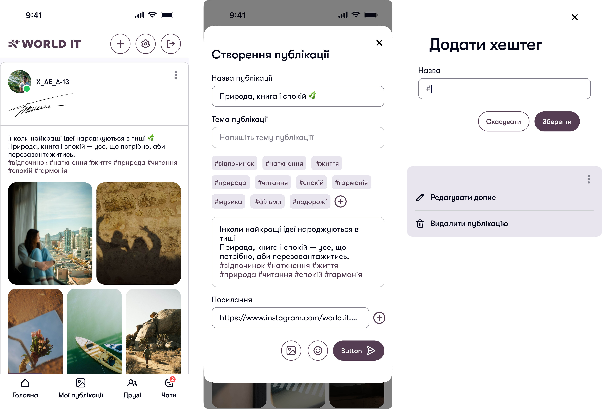
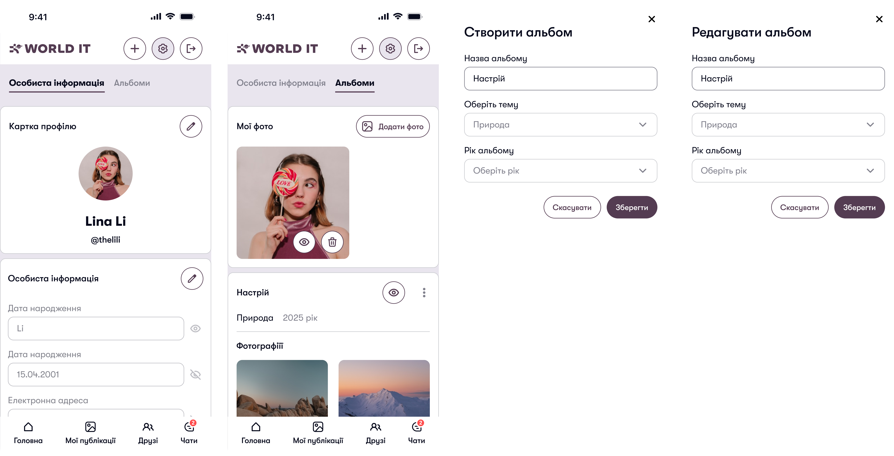

<p align="right">
    <a href="#topUA">
        
    </a>
    <a href="#social-network">
        
    </a>
</p>

# Соціальна мережа

<a id="topUA"></a>

<p align="center">
    
</p>

## Мета створення проєкту
Метою проєкту є розробка сучасного клієнтського застосунку соціальної мережі з використанням сучасних вебтехнологій.

Проєкт дозволив учасникам:
- отримати практичний досвід командної розробки
- освоїти роботу з React/Next.js
- навчитися працювати з TypeScript
- реалізувати взаємодію з REST API
- вдосконалити навички роботи з Git та GitHub
- навчитись деплоїти проєкт та створювати apk файл

Для початківців цей проєкт демонструє побудову масштабованого frontend-застосунку із модульною архітектурою.

## Склад команди

| Учасник | GitHub |
|----------|--------|
| Ващенко Артем | https://github.com/VashchenkoArtem |
| Харлан Кирило | https://github.com/KirillKharlan |
| Коцаба Анастасія | https://github.com/AnastasiiaKotsaba |
| Галкін Єгор | https://github.com/EgorGalkinORG |
| Марков Діма | https://github.com/ |

## Каталог
* [Мета створення проекту](#мета-створення-проєкту)
* [Склад комади](#склад-команди)
* [Використані технології](#використані-технології)
* [Як запустити проєкт](#як-запустити-проєкт)
* [Опис застосунку](#опис-застосунку)
* [Висновки](#висновки)


## Використані технології

<p align="left">

  - 
   
  - 
  
  - 
  
  - 
  
  - 
  
  - 
</p>

## Як запустити проєкт

<div align="left">

**1.** Створіть папку, де буде зберігатись проєкт

**2.** Склонуйте репозиторій (кнопка **Code** у GitHub)

```bash
git clone <url>
```

**3.** Перейдіть у створену папку

```bash
cd Social-Network-Frontend
```

**4.** Встановіть усі необхідні модулі

```sh
npm install
```

**5.** Запустіть проєкт

```sh
npm run start
```

</div>
 
## Опис застосунку

> [!NOTE]
> Проєкт побудований за модульною архітектурою (**Feature-Based Architecture**), де кожен функціональний блок ізольований та відповідає лише за власну область логіки. Це значно спрощує масштабування, підтримку та повторне використання коду.

<details>
<summary>
  <b style="font-size: 17px">Структура модулів</b>
</summary>

<table>
<tr>
<td width="50%">

### 📡 `api`
Містить логіку взаємодії із сервером:
- REST API запити
- RTK Query endpoints
- отримання, створення, оновлення та видалення даних
- роботу із сокетами та асинхронними операціями

</td>

<td width="50%">

### 🎨 `ui`
Містить усі компоненти інтерфейсу користувача:

- форми
- картки
- модальні вікна
- списки
- елементи відображення даних

</td>
</tr>

<tr>
<td width="50%">

### 🧩 `models`
Містить бізнес-логіку модуля:

- схеми валідації
- типи даних
- допоміжні функції
- роботу зі станом.

</td>

<td width="50%">

### 🌐 `context`
- містить React Context для передачі глобального стану між компонентами 
- без необхідності прокидувати пропси через багато рівнів вкладеності.

</td>
</tr>
</table>
</details>

<details>
<summary>
  <b style="font-size: 17px">Основні модулі застосунку</b>
</summary>


### `auth` - відповідає за повний процес автентифікації та ідентифікації користувача.

### Функціонал:

- реєстрація нових користувачів
- двоетапна реєстрація:
1. введення основних даних
2. підтвердження електронної пошти за допомогою коду
- авторизація користувача
- зберігання інформації про поточного користувача
- керування станом автентифікації
- валідація форм
- відновлення сесії після повторного запуску застосунку

### Компоненти:

- `login-form` - форма для авторизації
- `registration-step-one` - перший крок реєстрації
- `gmail-verification` - підтвердження електронної пошти

### Загальний вигляд компонентів: 

<p align="center">
    
</p>

---

### `chats` - реалізує систему особистих та групових чатів у режимі реального часу.

### Функціонал:

- створення особистих та групових чатів
- перегляд списку та учасників чатів
- пошук серед чатів
- додавання користувачів до груп
- вибір учасників групового чату

### Компоненти:

- `Chat` — відображення окремого чату
- `Contacts` — список контактів
- `Contact` — окремий контакт
- `groupChats` — список групових чатів
- `personalChats` — список особистих чатів
- `CreateGroupModal` — створення групового чату
- `SelectParticipantsModal` — вибір учасників
- `ConfirmGroupModal` — підтвердження створення групи
- `PersonalChatFrame` — контейнер для особистого листування
- `ChatAvatar` — відображення аватарів чатів

### Загальний вигляд компонентів:

<p align="center">
    
</p>

---

### `friends` - модуль, що відповідає за соціальну взаємодію між користувачами.

### Функціонал:

- перегляд списку друзів
- перегляд профілю друга
- надсилання запитів у друзі
- прийняття або відхилення запитів
- перегляд рекомендованих користувачів
- керування дружніми зв'язками

### Компоненти:

- `allFriends` — список усіх друзів
- `friendAlbum` — альбоми користувача
- `friendCard` — картка друга
- `friendFrame` — контейнер сторінки друга
- `friendProfile` — профіль друга
- `friends` — сторінка друзів
- `recommended` — рекомендовані користувачі
- `requests` — вхідні та вихідні запити в друзі
  
### Загальний вигляд компонентів:

<p align="center">
    
</p>

---

### `message` - відображення повідомлень у чатах.

### Функціонал:

- відображення повідомлень
- групування повідомлень
- відображення статусу повідомлення 
- відображення вкладень та медіафайлів
- підтримка списків повідомлень

### Компоненти:

- `message` — окреме повідомлення
- `messages` — список повідомлень

### Загальний вигляд компонентів:

<p align="center">
    
</p>

---

### `posts` - соціальної стрічка застосунку

### Функціонал:

- створення, редагування та видалення  постів
- перегляд стрічки новин
- завантаження фотографій
- додавання тегів
- відображення загальних постів та створених власноруч
- взаємодія з публікаціями

### Компоненти:

- `create-post-form` — форма створення та редагування поста
- `home` — головна стрічка новин
- `myPosts` — пости поточного користувача
- `PostCard` — картка окремого поста

### Загальний вигляд компонентів:

<p align="center">
    
</p>

---

### `settings` - модуль, що забезпечує керування персональними даними користувача.

### Функціонал:

- редагування особистої інформації
- зміна аватара
- додавання фотографій до альбомів
- створення та видалення альбомів
- видалення фотографій
- керування медіафайлами профілю
- відновлення пароля
- оновлення персональних даних

### Компоненти:

- `personal-information` — редагування особистих даних
- `avatar-field` — зміна аватара
- `avatarAddPhoto` — додавання фото профілю
- `albumAddPhoto` — додавання фотографій до альбому
- `albumItem` — елемент альбому
- `albums` — список альбомів
- `deleteAlbum` — видалення альбому
- `deletePhoto` — видалення фотографій
- `recovery-password` — відновлення пароля.

### Загальний вигляд компонентів:

<p align="center">
    
</p>

</details>

<details>
<summary>
  <b style="font-size: 17px">Переваги архітектури</b>
</summary>

✅ Чіткий розподіл відповідальності між модулями  
✅ Легке масштабування застосунку  
✅ Просте повторне використання компонентів  
✅ Зручна підтримка та тестування коду  
✅ Незалежність функціональних блоків  
✅ Висока читабельність структури проєкту

</details>

## Висновки

- У ході розробки було створено повноцінний клієнтський застосунок соціальної мережі, який надає користувачам широкий набір можливостей для комунікації, взаємодії та обміну інформацією. Архітектура застосунку побудована за модульним принципом, завдяки чому кожна функціональна частина системи є незалежною та відповідає лише за власну область відповідальності. Кожен модуль містить власні компоненти інтерфейсу, логіку взаємодії із сервером, механізми валідації та засоби керування станом. У застосунку реалізовано повний цикл роботи користувача із системою: від реєстрації до взаємодії з іншими користувачами.Особлива увага була приділена реалізації соціальних можливостей платформи. Користувачі можуть надсилати запити у друзі, переглядати профілі інших користувачів, працювати з персональними альбомами та взаємодіяти із публікаціями. Крім того, застосунок підтримує обмін повідомленнями в режимі реального часу, створення особистих і групових чатів, а також забезпечує швидку та зручну комунікацію між учасниками системи. Для організації роботи з даними використовується REST API, що забезпечує ефективну взаємодію між клієнтською та серверною частинами застосунку. Таким чином, поставлені цілі були повністю досягнуті, а отриманий результат являє собою сучасний, функціональний та зручний програмний продукт, що відповідає актуальним вимогам до розробки соціальних платформ.


<p align="right">
  <a href="#topUA">
    (вгору ⬆)
  </a>
</p>

---

<p align="right">
    <a href="#topUA">
        
    </a>
    <a href="#social-network">
        
    </a>
</p>

# Social Network

<a id="topENG"></a>

<p align="center">
    
</p>

## Project Goal

The goal of this project is to develop a modern client-side social network application using contemporary web technologies.

This project allowed participants to:
- gain practical experience in team-based development
- learn how to work with React/Next.js
- improve TypeScript skills
- implement interaction with a REST API
- enhance Git and GitHub workflow skills
- learn how to deploy the project and generate an APK file

For beginners, this project demonstrates how to build a scalable frontend application with a modular architecture.

## Team Members

| Participant | GitHub |
|------------|--------|
| Artem Vashchenko | https://github.com/VashchenkoArtem |
| Kyrylo Kharlan | https://github.com/KirillKharlan |
| Anastasiia Kotsaba | https://github.com/AnastasiiaKotsaba |
| Yegor Galkin | https://github.com/EgorGalkinORG |
| Dmytro Markov | https://github.com/ |

## Table of Contents

- [Project Goal](#project-goal)
- [Team Members](#team-members)
- [Technologies Used](#technologies-used)
- [How to Run the Project](#how-to-run-the-project)
- [Application Overview](#application-overview)
- [Conclusion](#conclusion)

---

## Technologies Used

<p align="left">

  - 
  - 
  - 
  - 
  - 
  - 
</p>

---

## How to Run the Project

<div align="left">

**1.** Create a folder where the project will be stored

**2.** Clone the repository (use the **Code** button on GitHub)

```bash
git clone <url>
```

**3.** Navigate to the project directory
```bash
cd Social-Network-Frontend
```

**4.** Install all required dependencies
```sh
npm install
```

**5.** Run the project
```sh
npm run start
```

---

## Application Overview

> [!NOTE]
> The project is built using a modular Feature-Based Architecture, where each functional block is isolated and responsible only for its own logic domain. This significantly improves scalability, maintainability, and code reusability.

<details>
<summary>
  <b style="font-size: 17px">Module Structure</b>
</summary>

<table>
<tr>
<td width="50%">

### 📡 `api`
Handles all server communication logic:
- REST API requests
- RTK Query endpoints
- CRUD operations
- socket handling and async operations

</td>

<td width="50%">

### 🎨 `ui`
Contains all user interface components:
- forms
- cards
- modals
- lists
- data presentation elements

</td>
</tr>

<tr>
<td width="50%">

### 🧩 `models`
Contains business logic:
- validation schemas
- data types
- helper functions
- state handling

</td>

<td width="50%">

### 🌐 `context`
- React Context for global state sharing
- avoids deep prop drilling

</td>
</tr>
</table>
</details>

---

<details>
<summary>
  <b style="font-size: 17px">Core Application Modules</b>
</summary>

### `auth` — handles full user authentication and identity flow

### Features:
- user registration
- two-step registration:
  1. basic data entry
  2. email verification via code
- user login
- current user state management
- authentication state handling
- form validation
- session restoration after app restart

### Components:
- `login-form`
- `registration-step-one`
- `gmail-verification`

<p align="center">
    
</p>

---

### `chats` — real-time personal and group chat system

### Features:
- creation of personal and group chats
- chat list and participant view
- chat search
- adding users to groups
- participant selection for group chats

### Components:
- `Chat`
- `Contacts`
- `Contact`
- `groupChats`
- `personalChats`
- `CreateGroupModal`
- `SelectParticipantsModal`
- `ConfirmGroupModal`
- `PersonalChatFrame`
- `ChatAvatar`

<p align="center">
    
</p>

---

### `friends` — social interaction module

### Features:
- friend list management
- friend profile viewing
- sending friend requests
- accepting/rejecting requests
- recommended users
- managing friendships

### Components:
- `allFriends`
- `friendAlbum`
- `friendCard`
- `friendFrame`
- `friendProfile`
- `friends`
- `recommended`
- `requests`

<p align="center">
    
</p>

---

### `message` — chat message rendering system

### Features:
- message display
- message grouping
- message status indicators
- attachments and media support
- message list rendering

### Components:
- `message`
- `messages`

<p align="center">
    
</p>

---

### `posts` — social feed module

### Features:
- create, edit, delete posts
- news feed rendering
- image uploads
- tag system
- personal and global posts
- post interactions

### Components:
- `create-post-form`
- `home`
- `myPosts`
- `PostCard`

<p align="center">
    
</p>

---

### `settings` — user profile management

### Features:
- editing personal data
- avatar updates
- album management
- photo uploads and deletion
- password recovery
- profile media management

### Components:
- `personal-information`
- `avatar-field`
- `avatarAddPhoto`
- `albumAddPhoto`
- `albumItem`
- `albums`
- `deleteAlbum`
- `deletePhoto`
- `recovery-password`

<p align="center">
    
</p>

</details>

---

<details>
<summary>
  <b style="font-size: 17px">Architecture Benefits</b>
</summary>

- Clear separation of responsibilities  
- Easy scalability  
- Reusable components  
- Maintainable and testable codebase  
- Independent functional modules  
- High readability of project structure  

</details>

---

## Conclusion

- During development, a fully functional client-side social network application was built, providing users with a wide range ocommunication and interaction features. The system is based on a modular architecture, ensuring that each functional unit is independenand responsible for its own domain. Each module contains its own UI components, server communication logic, validation mechanisms, anstate management tools. The application implements a full user lifecycle, from registration to active social interaction. Speciaattention was given to social features, including friend requests, user profiles, albums, and post interactions. Additionally, thsystem supports real-time messaging, including both private and group chats, enabling fast and efficient communication. Data exchange ihandled via REST API, ensuring reliable client-server interaction. Overall, the project objectives were fully achieved, resulting in modern, scalable, and user-friendly social platform aligned with current frontend development standards.


<p align="right">
    <a href="#topENG">
    ( scroll to top ⬆)
    </a>
</p>
